# Social_app
## DESCRIPTION 
Main menu where the login user can see: 

  1)Posts. It contained a sub menu  to filter posts from all users(with pagination and search bar), liked posts, posts from friends and posts from follow users. 

   Posts created by the login user can be deleted or modified. The login user can create a new post and leave a comment on any post, the user can also see all comments related with a post.

  2)Find friends. Display all users, you can follow/unfollow a user and send a friend request.

  3)Notifications. Shows pending friend request(you can accept or delete the request) and sent requests.

  4)Profile. User can modify and delete account. Contains a sub menu to see all your posts, all your friends, you followers and users you are following.

### The app is fully responsive. It was build with Django for the backend and React for frontend, with Redux, Route, etc, and docker. 

### For the fronted test cases(unit and integration) it was done with Jest library.

## RUN THIS APP WITH:
 1. Install docker  https://docs.docker.com/docker-for-mac/install/
 2. Clone the repository with ->  git@github.com:jgibbons3/Social_app.git
 3. docker-compose up 
 4. Check your local host ->   http://localhost:3000/ 
 5. Login with email test@test.com password 123test_test

 

 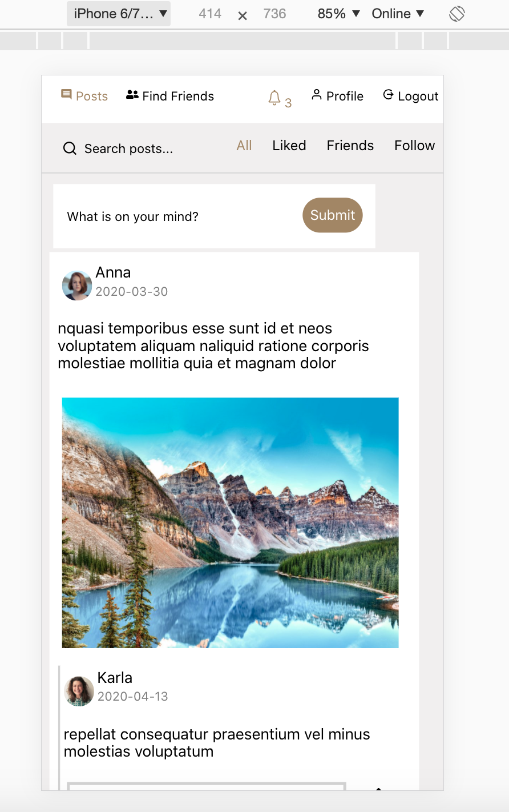  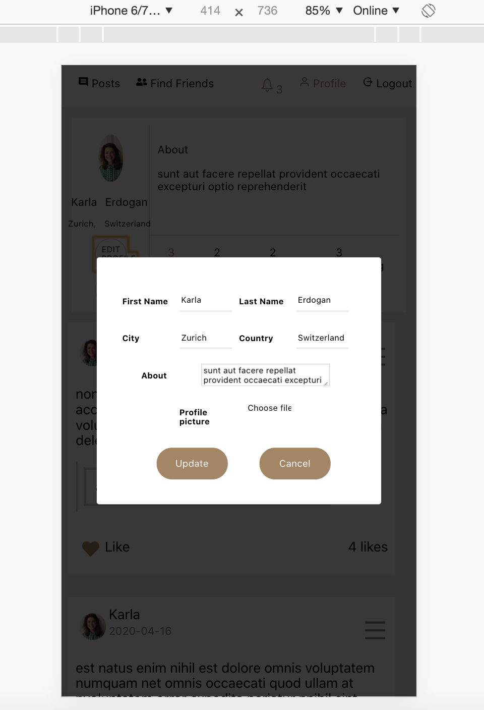
 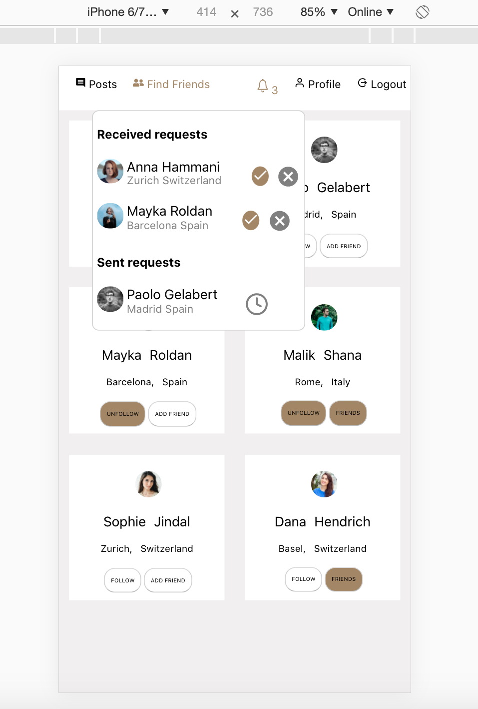
 

 
 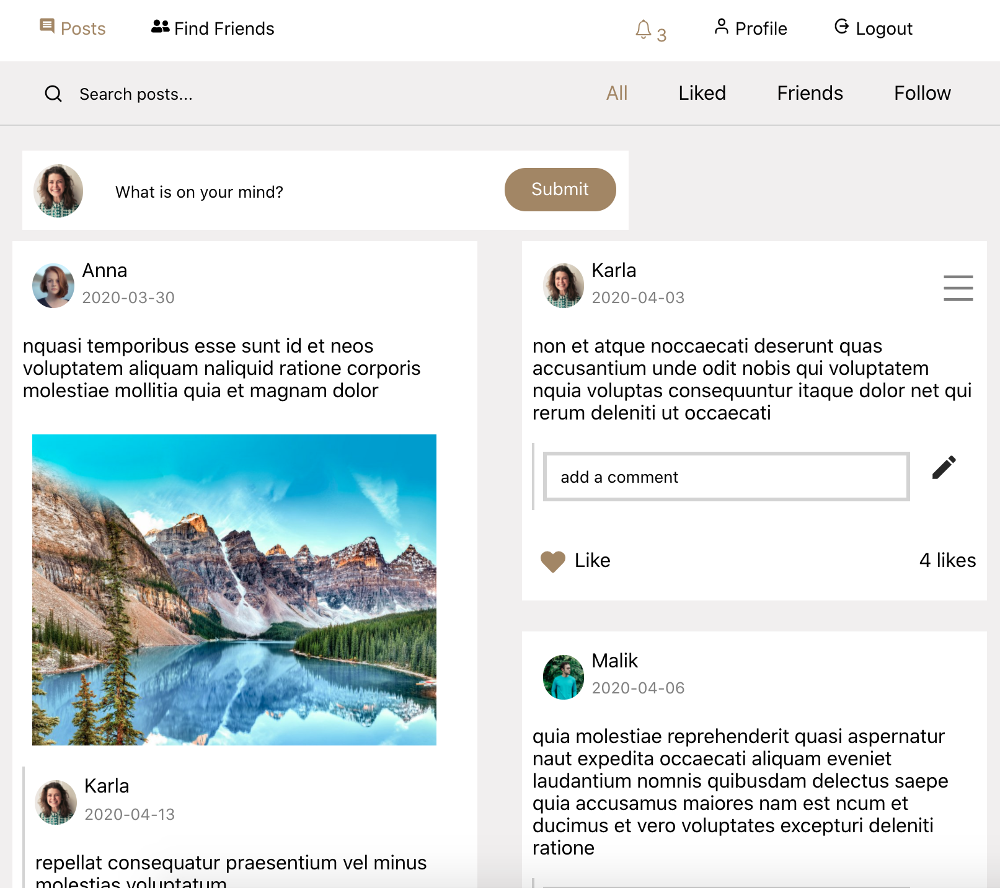 
 
 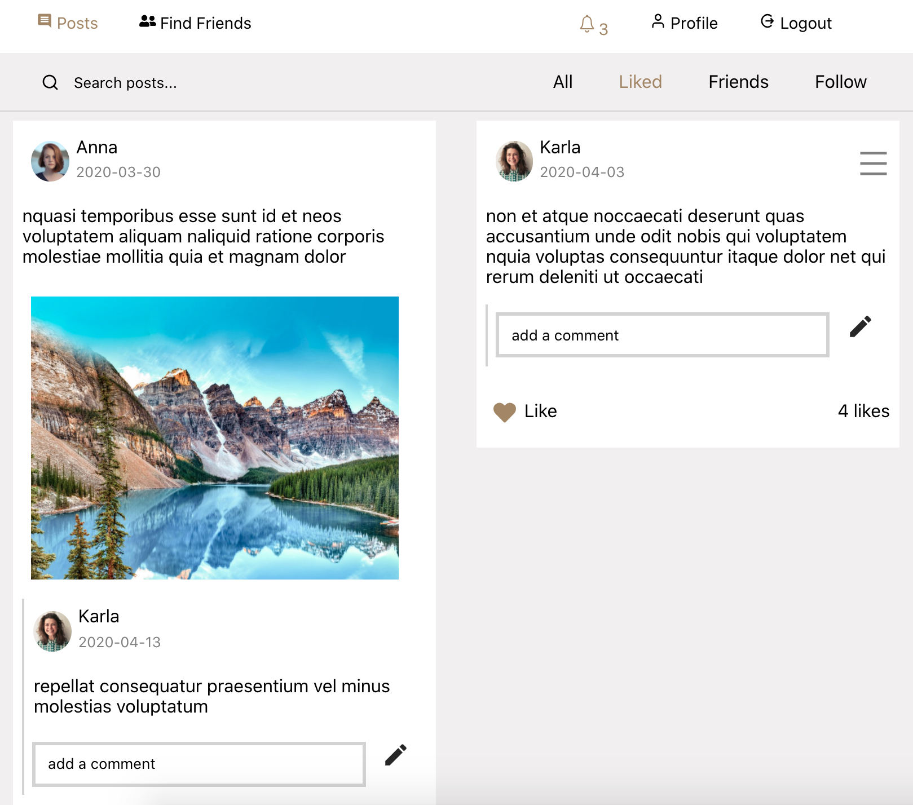

 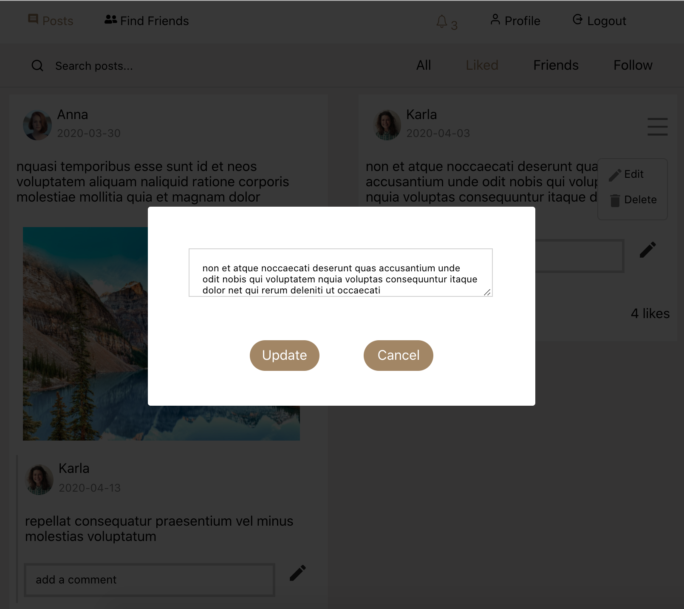
 
 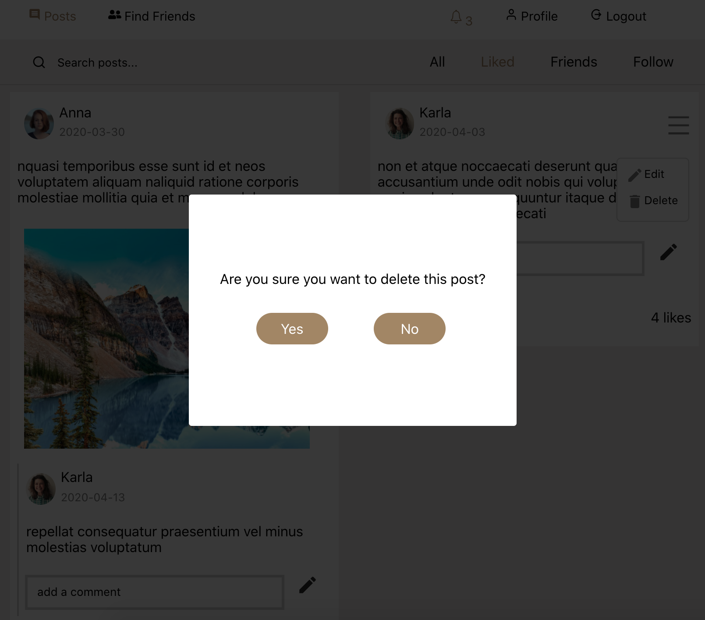
 
 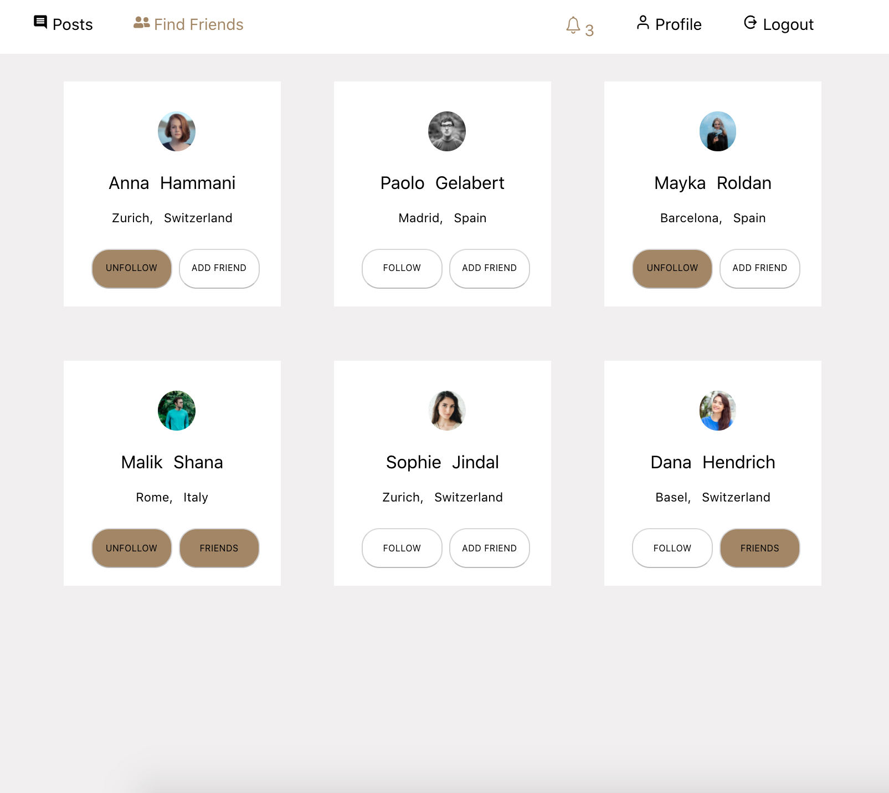
 
 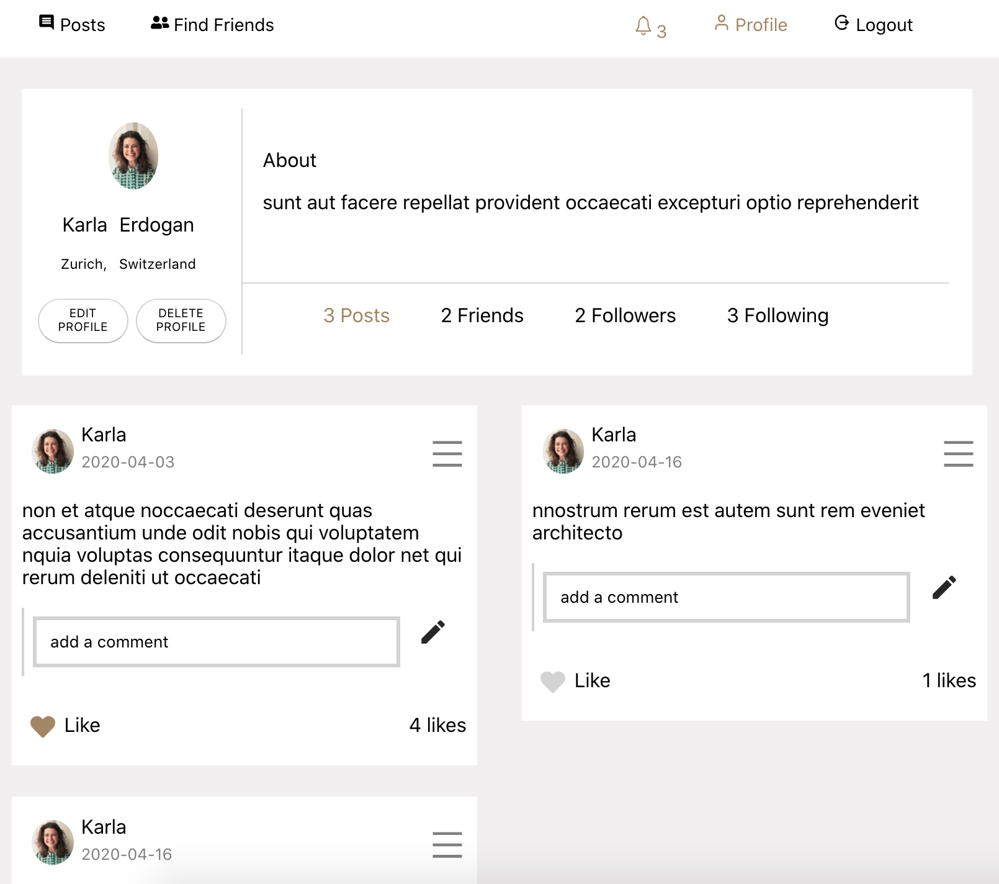
 
 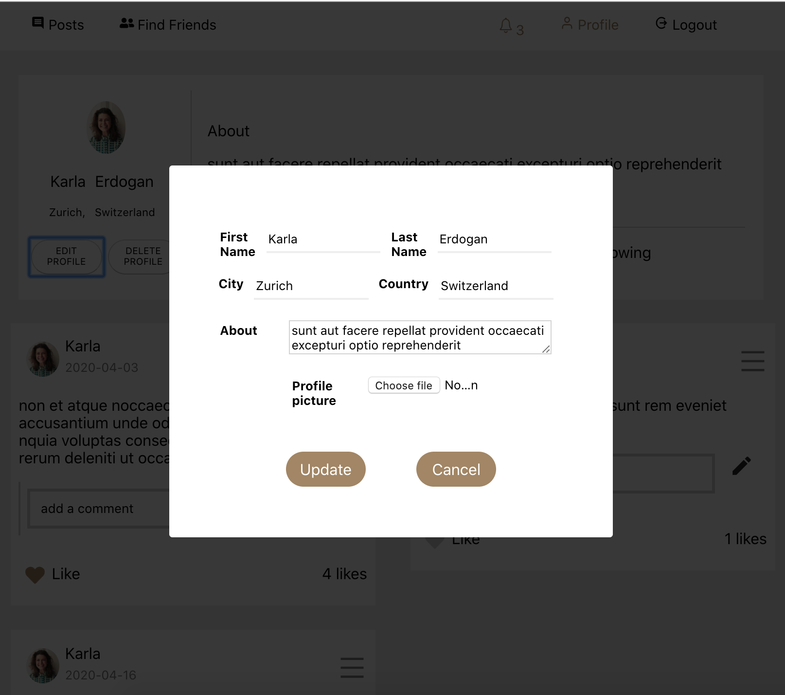
 
 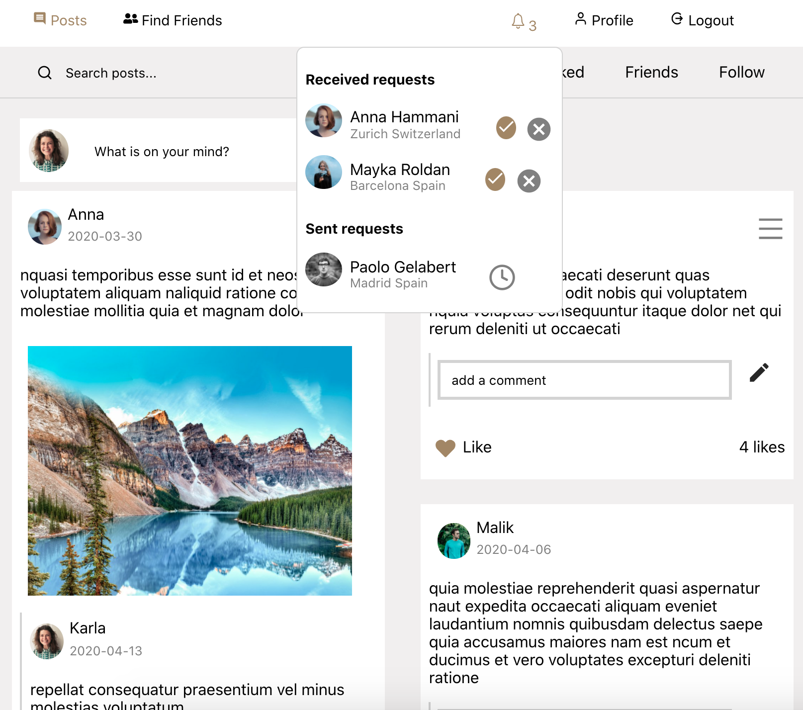
 
 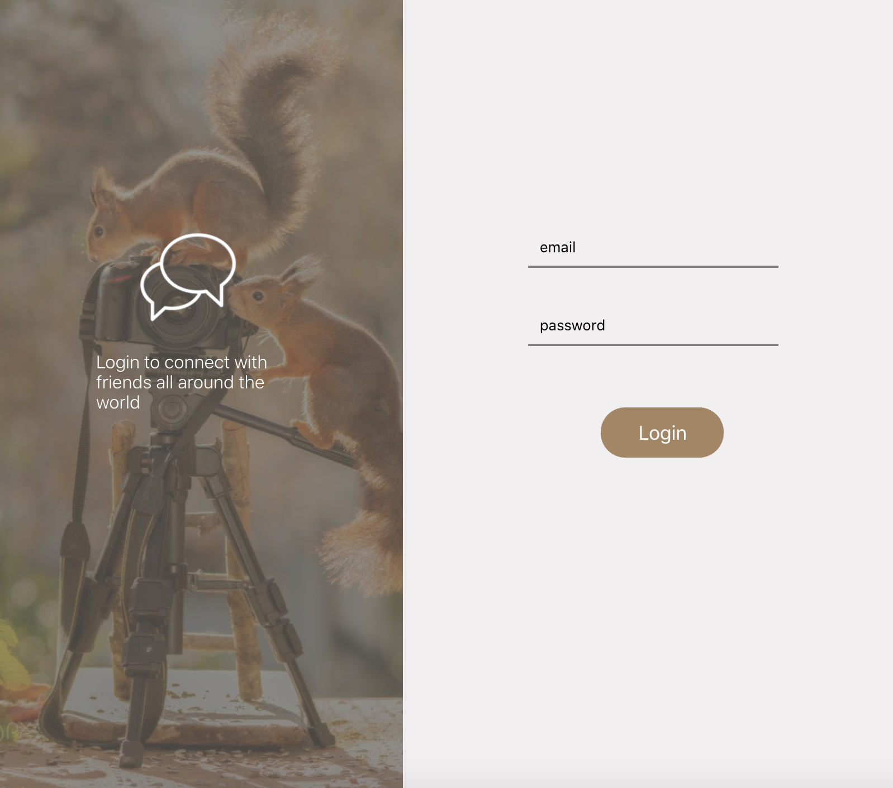
